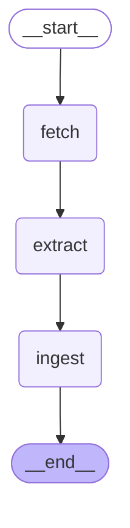
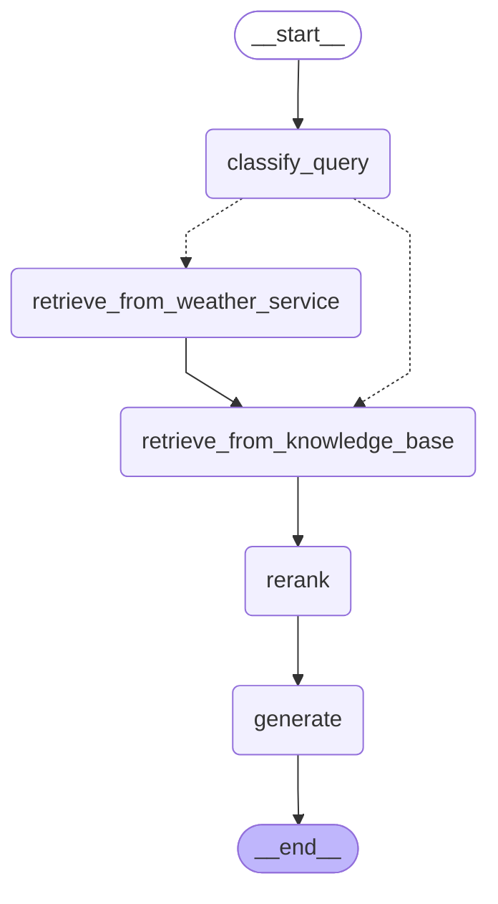

## Description

An agentic RAG engine with support for heterogeneous source data formats, query routing between local and external knowledge sources, multiple topics.

Components:

- LangGraph ingestion workflow
- LangGraph query workflow
- FastAPI backend
- Admin CLI
- NextJS front end (in a [separate repository](https://github.com/bard/rag-frontend))

## Demo

https://github.com/user-attachments/assets/c88b5ef3-7ba8-4a83-84d1-d33a4f0e67cd

<!-- markdown-toc start - Don't edit this section. Run M-x markdown-toc-refresh-toc -->

**Table of Contents**

- [Description](#description)
- [Setup](#setup)
- [Running the API](#running-the-api)
- [Running the front end](#running-the-front-end)
- [Running the CLI](#running-the-cli)
- [Development](#development)
- [Architecture and development notes](#architecture-and-development-notes)
- [The ingestion workflow](#the-ingestion-workflow)
- [The query workflow](#the-query-workflow)
- [Modelling, configuration, dependencies](#modelling-configuration-dependencies)
- [LLMs and testing](#llms-and-testing)
- [Limitations and possible improvements](#limitations-and-possible-improvements)

<!-- markdown-toc end -->

## Setup

```sh
git clone https://github.com/bard/rag-engine
cd rag-engine
poetry install
cp .env.example .env
```

Edit `.env` to specify API keys and database connection strings.

## Running the API

```sh
poetry run task start_api
```

## Running the front end

```sh
git clone https://github.com/bard/rag-frontend
cd rag-frontend
pnpm install
pnpm dev
```

## Running the CLI

```sh
$ poetry shell
$ python src/cli.py initdb

Database initialized successfully

$ python src/cli.py create_topic --name Paris

Created topic 'Paris' with ID: 059a97ed-3d7d-4fc9-a2b6-9b12df52b414

$ python src/cli.py ingest https://en.wikivoyage.org/wiki/Paris

Data ingested successfully

$ python src/cli.py list_topics

Available topics:
  059a97ed-3d7d-4fc9-a2b6-9b12df52b414: Paris

$ poetry run python src/cli.py query --topic_id 059a97ed-3d7d-4fc9-a2b6-9b12df52b414 'what are some nice things to see?'

Some nice things to see in Paris include the Eiffel Tower, the Louvre Museum, and Notre-Dame Cathedral. Additionally, the charming neighborhood of Montmartre and the historic district of Le Marais are also worth exploring.
```

## Development

Run tests in watch mode:

```
poetry run task test_watch
```

When adding a test for code that relies on LLM calls, run `poetry run task test_with_new_network_calls` (see [LLMs and testing](#llms-and-testing) below.)

## Architecture and development notes

### The ingestion workflow



There are three data extractors, meant to provide a framework and examples within the framework, not to exhaust the possibilities:

- [specialized local parsing for well-known structured data](https://github.com/bard/rag-engine/blob/ateam/src/data/insurance_average_expenditure.py) (on the [ateam branch](https://github.com/bard/rag-engine/tree/ateam))
- [generic textual data](src/data/textual.py)
- [generic LLM-driven parsing of tabular data](src/data/generic_tabular.py)

[extract](src/workflow_ingest/node_extract.py) runs through extractors in sequence until one is successful. It's up to the extractor to bail out early if it recognizes it cannot do anything useful with the received data.

### The query workflow



The conditional edge and the node `retrieve_from_weather_service` isn't necessarily the best design for sourcing external knowledge, and a case could be made for either:

- the `classify_query` node populating an `external_knowledge_sources` array in the agent's state with a list of sources it decided it would be useful to query (the `classify_query` already does this for the limited case of weather queries), then passing control to the `retrieve` node for retrieval from all knowledge sources, both local and external;
- defining external knowledge sources as LangChain tools and leaving it to the LLM to decide whether to call call those tools.

### Modelling, configuration, dependencies

Class abstractions for the agentic functionality are intentionally avoided since configuration and state are already covered by LangGraph-native concepts (agent state and `RunnableConfig`).

All runnables (workflow nodes, but also API route handlers and CLI commands) instantiate their own dependencies (database connections, third-party API clients, ...) upon invocation, based on the configuration object, instead of expecting them from module scope. Together with the configuration object being strictly serializable, this allows extracting a runnable to a separate process (e.g. lambda) with minimal effort if the need arises.

### LLMs and testing

[vcr.py](https://vcrpy.readthedocs.io/en/latest/) is used to keep tests realistic, cheap, fast, and to protect from the variability of LLM responses. When a test marked with `@pytest.mark.vcr` runs for the first time, requests go to the network and responses are recorded; in subsequent runs, recorded responses are replayed, thus avoiding latency and API billing, and ensuring stable responses.

### Limitations and possible improvements

The following is missing:

- database migrations
- post-retrieval reranking (only stubbed)
- protection against prompt injection
- monitoring
- support for vector stores other than ChromaDB (Pinecone is stubbed)
- multi-user
- per-task LLM configuration

Any SQL database supported by SQLAlchemy should work, but only SQLite and Postgres are tested.
